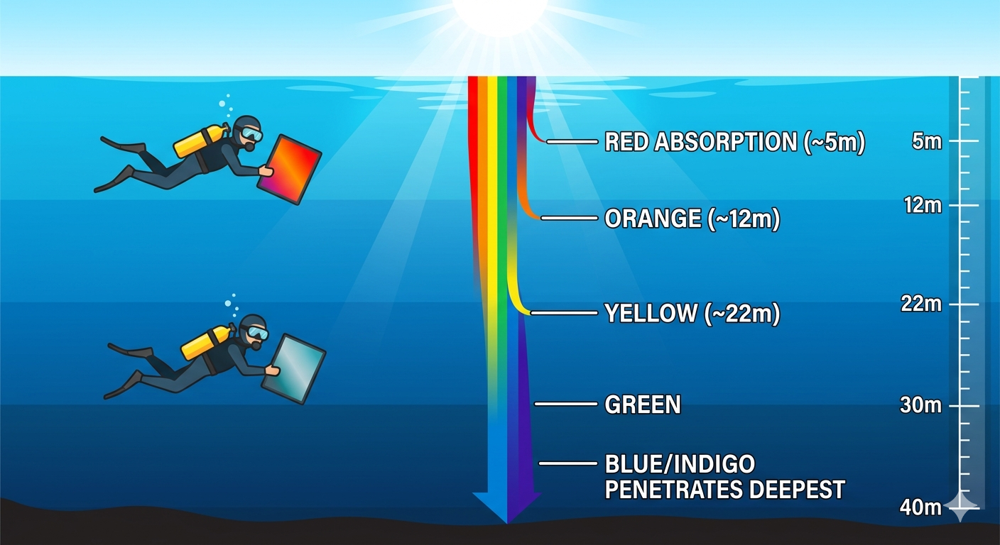

# 色彩原理与调色 (Color & Post-Processing)

## 光在水中的物理原理：耦合吸收 (Coupled Absorption)
光在水中的传播与大气不同。水相当于强大的污染物和衰减器。光的衰减主要由两个物理过程导致：**吸收**和**散射**。

### 吸收规律（颜色消失的垂直地图）

-   **暖色（长波长）衰减最快**：水分子更容易吸收。
    -   **红色**：第一个消失（约5m左右）。
    -   **橙色**：约10-15m消失。
    -   **黄色**：约20-25m消失。
-   **冷色（短波长）穿透最深**：水分子对蓝、绿光的吸收减弱。
    -   **绿色**：能到达较深处。
    -   **蓝色**：染色力最强，这也是为什么清澈海水呈蓝色（其他颜色被吸收，仅蓝色反射）。

### 现实影响
在20m深的自然光下，主体会显得灰蒙蒙的蓝绿色，因为环境光中已没有红、橙、黄光来还原真实色彩。

## 后期调色流程
软件推荐：Final Cut Pro (FCPX)、DaVinci Resolve。

### 调色步骤
1.  **曝光调整**：首先校正画面的明暗。
2.  **色温/白平衡**：根据水下特点还原环境。
3.  **肤色矫正**：在水下摄影中肤色不是唯一标准，但人们更容易接受。
4.  **风格化**：磨皮、加噪、电影感调色。

### 调色逻辑
-   **近景优先**：调色过程中，整体拉暖时近处前景先发暖（红橙黄）。
-   **多维调整**：利用不同色彩（如蓝色还原）、亮度、对比度将颜色调整到目标。
-   **系统性思维**：调色不只是软件操作，而是理解整个色彩系统。
